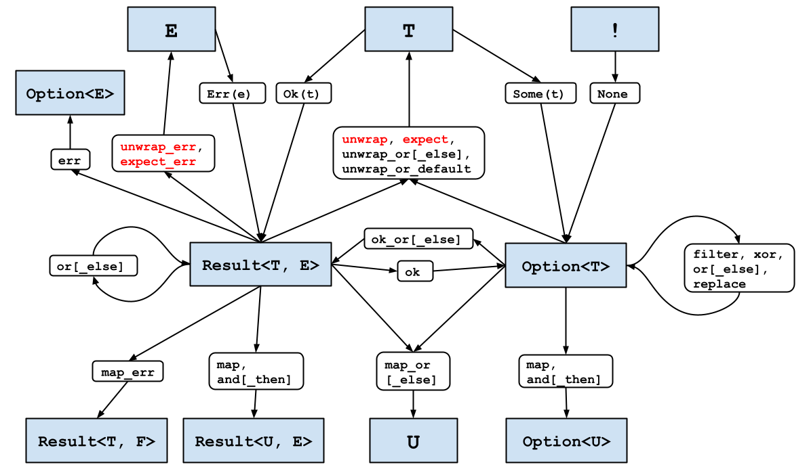

# Option and Result

**One line:** Rust has no null and no exceptions — it has two ordinary enums, `Option` for a value that may be absent and `Result` for an operation that may fail, and a compiler that will not let you read either one without saying what happens in the other case.

Neither type is built into the language. Both are enums anyone could have written, which is worth knowing early: everything in this section is a method on a normal type, and you can read the source. What the language contributes is `match` — because it must account for every variant, "I forgot the empty case" stops being a class of bug and becomes a build error.

The bulk of the section is the middle ground between `match` and `.unwrap()`. There are a dozen small methods that each answer one question — what if it is missing, what if I want to transform it, what if building the fallback is expensive — and choosing among them is most of what fluency in Rust looks like from the outside.

Those methods have a shape, and it is worth seeing once before you start — nothing below assumes you already know it. Every box is a type, every label is a method that moves you between types, and the two blue boxes in the middle are the pair this section is about:

*Figure 1-1, "`Option` and `Result` transformations", from [Effective Rust ↗](https://effective-rust.com/transform.html) by David Drysdale, © 2024 Galloglass Consulting Limited. Reproduced unmodified under [CC BY-NC-ND 4.0 ↗](https://creativecommons.org/licenses/by-nc-nd/4.0/); [original drawing ↗](https://docs.google.com/drawings/d/1EOPs0YTONo_FygWbuJGPfikO9Myt5HwtiFUHRuE1JVM/preview).*

Red marks the four that can panic. Notice where they land: `unwrap` and `expect` reach `T` through the same box as `unwrap_or[_else]` and `unwrap_or_default`, which reach that identical `T` without ever aborting. Same destination, different answer on the sad arm — and choosing between those two behaviours is most of what the pages below are teaching.

| Lesson | Level | What it teaches |
|---|---|---|
| [`Some` and `None`](some_and_none/README.md) | 101 | The enum itself: two shapes, one exhaustive `match`, and why `Some(0)` is not `None` |
| [`Some` is a constructor, not a flag](some_is_a_constructor/README.md) | 101 → 201 | Why `Some(None)` is `E0308` and not "present but empty" — `Some` is a `fn(T) -> Option<T>`, so the argument must be the payload; plus the one type where `Some(None)` is the right answer |
| [`Option` vs `Result`](option_vs_result/README.md) | 101 | Absence versus failure — and the single question ("could the caller ask *why not?*") that decides which type you want |
| [What a monad is](what_a_monad_is/README.md) | 301 | The shape `Option`, `Result` and `Vec` all share — and why Rust uses monads without ever saying the word |
| [`if let`](if_let/README.md) | 101 | A `match` with one arm — the family (`if let` / `let … else` / `while let` / `matches!`), and the exhaustiveness you trade away |
| [`while let`](while_let/README.md) | 201 | The loop whose exit condition is a pattern — and the one bug `if let` cannot have: a body that never makes progress |
| [One arm, many values](one_arm_many_values/README.md) | 101 → 201 | `8 \| 12 \| 18` and `0..=7`: the two ways to widen a `match` arm, the two lints that catch a botched collapse, and the one mistake neither can see |
| [`unwrap_or`](unwrap_or/README.md) | 201 | The default you already have — eager, consuming, and it erases the very difference it stood in for |
| [`unwrap_or_else`](unwrap_or_else/README.md) | 201 | The lazy fallback — built only if needed, allowed to consume what it captures, and on a `Result` the only one handed the error |
| [`unwrap_or_default`](unwrap_or_default/README.md) | 201 | The fallback the *type* chose — a derived `Default` is the type's zero, not your domain's, and a missing impl is a guard rail |
| [`map_or` and `map_or_else`](map_or/README.md) | 201 | Transform *and* fall back in one call — the default written first and run last, and the clippy lint on each side of it |
| [`expect`](expect/README.md) | 201 | The message is a claim about why this cannot fail — and being unable to write it is the finding |
| [What a panic costs](what_a_panic_costs/README.md) | 201 | The other half of `unwrap`: where the panic points, what unwinding gives back (memory) and what it does not (your work), and why the exit code is 101 |
| [Partial functions](partial_functions/README.md) | 201 | Why `Option` exists at all: it turns a function that is undefined somewhere into one that always answers |
| [Returning `None` on error](none_on_error/README.md) | 201 | Why `input.parse().ok()` is usually a downgrade: four distinct causes arriving as one indistinguishable `None` |
| [Zero wins is not zero games](wrong_guard/README.md) | 201 | A guard on the wrong condition: the input with no answer is the one that gets a number, and `Result` does not stop it |
| [Initial values](initial_values/README.md) | 201 | The job where `Option` is usually the *wrong* tool — Rust lets you declare without initializing and proves you assigned |
| [Optional function arguments](optional_arguments/README.md) | 201 | No default parameters, no overloading — the five shapes that replace them, and why `Option<&T>` beats `&Option<T>` |
| [`Option` fields](option_fields/README.md) | 101 | `Option` in a type definition: required-by-default fields, and when `Option<Vec<T>>` is right |
| [`Option` is a one-item collection](option_as_collection/README.md) | 201 | It iterates; `None` really is variant 0; and why the tag is often free |
| [Nullable pointers](nullable_pointers/README.md) | 201 | Rust has no null, so an absent pointer is a different type — `Option<Box<T>>`, free, and what makes a recursive type possible |
| [The `Result` you are reading is probably an alias](result_aliases/README.md) | 201 | `io::Result<T>` is `Result<T, io::Error>` — how to expand an alias and read what can actually go wrong, plus `Ok(())` and `Infallible` |
| [Shadowing and `unwrap`](shadowing_and_unwrap/README.md) | 201 | Two unrelated ideas the tutorials tie together: what keeps the original `Option` alive is `Copy`, not the shadow — and what shadowing is really for |
| [Six kinds of zero](six_kinds_of_zero/README.md) | 201 | Where `Option` runs out: six reasons a cell is empty, one enum, and a report the compiler audits |

## Related sections

- [Enums](../13_Enums/README.md) — the feature both of these types are made of
- [Errors](../02_Errors/README.md) — what a `Result` does on its way out of a program somebody else runs
- [Ownership](../18_Ownership/README.md) — why `unwrap` on a `String` consumes it and on an `i32` does not

[OPTION.md](../OPTION.md) is the full reading order, and lists the eight jobs the standard library says `Option` exists to do.
