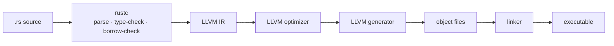

# Compilers

Most of what turns your `.rs` file into a binary was not written for Rust, and is not maintained by anyone on the Rust team.

That is the most useful fact in this section, and it explains why a compiler diagram is so crowded. Draw one and you get forty names — Clang, LLVM IR, LLD, RISC-V, CMake, LLDB, ART, GCC, MSVC — with no indication of which are rivals, which are stages of one program, and which are not compilers at all. They sort into five boxes.

| Box | Names in it | What they have in common |
|---|---|---|
| **Front ends** | rustc, Clang, GCC, MSVC, swiftc | One per language. Each parses its own syntax and enforces its own rules — Rust's borrow checker is here, and only here |
| **Stages inside one** | parser, optimizer, generator | Not separate programs. Phases every front end runs, in that order |
| **The shared middle** | LLVM, LLVM IR, Cranelift | Where the languages meet. rustc, Clang and swiftc hand off to the same optimizer and code generator |
| **Targets** | x86, x86-64, ARM, RISC-V | The instruction set at the far end. One compiler, many of these |
| **Standing nearby** | GNU ld, LLD, mold · CMake, Cargo · LLDB, GDB · JVM, ART | A linker, a build system, a debugger, a runtime. None of them compiles anything, and every one is routinely called "the compiler" by somebody debugging one |

## The three stages, end to end

**rustc** parses your source, type-checks it, borrow-checks it, and lowers it to LLVM IR — a typed, machine-independent assembly language. **LLVM** optimizes that IR and generates machine code for one target, emitting an object file per unit. **A linker** — `ld64`, GNU `ld`, `lld` — stitches those object files together with the libraries they name and produces one executable. **Cargo** drives all of it and compiles nothing itself.

Rust's distinctive part is the first box and nothing after it. Ownership, lifetimes, exhaustive `match`, trait coherence: all settled before LLVM sees anything. What comes out the far end is the same machine code a C++ program of the same shape would get, from the same optimizer, through the same linker — which is why "as fast as C" is a claim about the *middle* of this pipeline, where the two languages are sharing an implementation rather than achieving similar results separately.

Two consequences worth carrying:

- **A "compiler error" is at least four different things.** A parse error, a type error, a borrow error and a link error come from different stages, and the last one is not from rustc at all. Knowing which stage spoke tells you which model to fix.
- **What is slow is not what is complicated.** The borrow checker is the famous part and rarely the expensive one; codegen and linking usually dominate a build. [Compile times](../05_Tooling/compile_times/README.md) is the measurement.

## The lessons

| Lesson | Level | What it teaches |
|---|---|---|
| [What a compiler does before your program runs](what_a_compiler_does/README.md) | 101 | The compile-time/run-time line, made visible: a loop that runs during the build, an array length that proves it, and the two errors that live either side of the boundary |
| [What the optimizer does](what_the_optimizer_does/README.md) | 201 | Ten numbers summed in a loop compile to `mov eax, 55` — the same experiment the talk runs in C++, run in Rust, with both ends of the assembly quoted |
| [LLVM: the part of rustc that is not Rust](llvm_and_its_ir/README.md) | 201 | What the name actually refers to — a suite, a library, an IR and a pipeline — plus Clang, LLD and LLDB, real IR for a small function, and the control-flow graph read straight off it |
| [The linker: the stage that is not rustc](the_linker/README.md) | 201 | Two functions this crate never defines, called anyway — what an object file leaves blank, who fills it in, and why the error text is in a different dialect from every other error you have seen |
| [Control-flow flattening](control_flow_flattening/README.md) | 201 → 301 | The optimizer's permission aimed backwards: the same function flattened into a state machine, an opaque predicate that always holds, and the three layers where a pass can be inserted |

## Stubs

Outlines with no runnable example behind them yet — the same arrangement as [Errors](../02_Errors/README.md) and [Data](../06_Data/README.md), and each marked at the top of its page.

| Lesson | Level | What it will teach |
|---|---|---|
| [Targets and triples](targets_and_triples/README.md) | 201 | `x86_64-unknown-linux-gnu` is four decisions in a hyphenated string — and `rustup target add` gives you two of the three things a cross-build needs |
| [Compiled, interpreted, or something between](compiled_or_interpreted/README.md) | 101 | Where the JVM, ART, CPython and Rust actually differ — and why "compiled" describes a moment, not a language |
| [Reading a compilation failure](reading_a_compilation_failure/README.md) | 101 → 201 | Which stage is talking, what an `E0xxx` code buys you, and why a borrow error and a type error need different habits |
| [A build system is not a compiler](build_systems_are_not_compilers/README.md) | 201 | What CMake, Make and Cargo actually do — decide *what* to compile and in what order — and why "why did it rebuild everything?" is never a compiler question |

## Where this sits, and where it came from

[Tooling](../05_Tooling/README.md) is the loop you sit inside — edit, build, run — and [Compile times](../05_Tooling/compile_times/README.md) is that loop's stopwatch, phase by phase. This section is the altitude below: what each phase *is*, and who else is using the same machinery. [Unix](../11_Unix/README.md) is the shell you run all of it from.

The framing, the map and two of the experiments come from [Laurie Kirk's *Thinking Like a Compiler: Obfuscation from the Other Side* ↗](https://youtu.be/jfqFHHsYQAs) (RE//verse 2026), which arrives at the pipeline from the far end — a binary on a disassembler's screen, and the question of what the compiler must have done to it. It is worth an hour, and the Rust half of every experiment in it is on the pages above.
