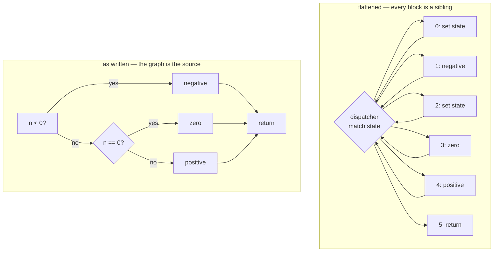
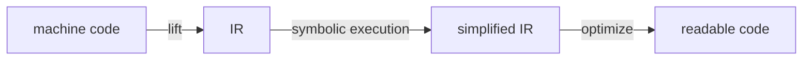

# Control-flow flattening: the optimizer's permission, used backwards

**Level:** 201 → 301 · deep dive

**One line:** An optimizer may replace your program with any program that behaves the same — and so may an obfuscator, which is the identical permission aimed at making the result unreadable rather than fast, running as a pass in the same pipeline.

[The optimizer](../what_the_optimizer_does/README.md) turned twenty-nine instructions into one because it could prove the result was always 55. Nothing in that argument says the replacement has to be *smaller*. A pass that turns six readable blocks into a forty-block dispatcher is following the same rule, and the toolchain runs it just as obediently.

## Flattening, by hand

The function is the one from [LLVM and its IR](../llvm_and_its_ir/README.md), whose control-flow graph is six blocks and reads exactly like its source. Flattened, every block becomes a numbered case under one loop, and every branch becomes an assignment to a state variable:

```rust
fn classify_flattened(n: i32) -> &'static str {
    let mut state = 0u32;
    let mut out = "";
    loop {
        match state {
            0 => state = if n < 0 { 1 } else { 2 },
            1 => { out = "negative"; state = 5; }
            2 => state = if n == 0 { 3 } else { 4 },
            3 => { out = "zero";     state = 5; }
            4 => { out = "positive"; state = 5; }
            _ => return out,
        }
    }
}
```

<!-- output:control_flow_flattening -->
*Verified output of [`control_flow_flattening.rs`](examples/control_flow_flattening.rs) — regenerated by `tools/run_examples.py`, never hand-typed.*

```text
classify( -7) = negative  flattened = negative  agree = true
classify( -1) = negative  flattened = negative  agree = true
classify(  0) = zero      flattened = zero      agree = true
classify(  1) = positive  flattened = positive  agree = true
classify( 42) = positive  flattened = positive  agree = true
opaque predicate held for all 1000 inputs: true
a - (-b) matched a + b on 1,000,000 pairs: true
(a^b) + 2*(a&b) matched a + b on 1,000,000 pairs: true
```
<!-- /output -->

Same answers, every input. What changed is the graph:



Before, the shape carries the meaning: two decisions, three outcomes, one exit — recoverable without reading a line of source. After, every block hangs off one node at the same depth and every edge returns to it. The picture says only *"there were some blocks"*, which is the whole objective. On a real function of a few hundred blocks that is the wall of parallel bars you see in a disassembler, and it is why decompiled output of an obfuscated binary looks like this:

```text
while ( 1 ) {
  while ( 1 ) {
    while ( 1 ) {
      v26 = v46;
      if ( v46 != -2118404143 ) break;
      ...
      v46 = 289045246;
```

A decompiler reconstructs loops from back-edges, and after flattening every block has one. The magic constants are the state values — an obfuscator picks large random ones precisely so they carry no ordering information, where the example above uses `0..=5` to stay legible.

## What the pass actually does, per block

The hand-written version above is not an analogy. The real pass walks every basic block and performs four edits on the IR, and each one has a line in the Rust:

| The pass, on one block | The Rust it corresponds to |
|---|---|
| Read the block's **terminator** — the `br` that ends it | `if n < 0 { .. } else { .. }` |
| Build a **select**: the branch condition choosing between the two successors' case numbers | `if n < 0 { 1 } else { 2 }` — a value, not a jump |
| **Erase** the terminator, so the block no longer decides anything | the block just assigns and falls through |
| **Store** the selected number into the switch variable and branch to the dispatcher | `state = ...; ` then round the `loop` again |

The middle step is the one that does the damage. A branch is an *edge in the graph*; a select is an *ordinary value*. After the swap, the decision still happens, but it has moved out of the control flow and into the data — so a tool reading the graph can no longer see it, and a tool reading the data has to prove what the value can be. Everything the source said about structure has become arithmetic on a state variable.

## Opaque predicates

The second standard trick is a condition that always takes the same branch, for a reason that is not local. `n * (n - 1)` is a product of consecutive integers, so one factor is even, so the product is:

```rust
fn always_true(n: u32) -> bool {
    n.wrapping_mul(n.wrapping_sub(1)) % 2 == 0
}
```

The example above runs it over a thousand inputs and it never fails. Wrap real code in `if always_true(x) { ... } else { <plausible nonsense> }` and an analyst now has a branch to reason about, dead code that looks live, and no way to prune it without proving the arithmetic identity. The compiler cannot fold it either — LLVM has no theorem about consecutive integers, which is the point: the predicate is chosen to be opaque to *the optimizer* as well as to the reader.

That is also the honest limit of the technique. Anything the optimizer *can* prove, it will delete, obfuscation included — so an obfuscation pass has to run late, and every trick in it is a bet that the analyst's tools are weaker than the compiler's.

## Instruction substitution

Flattening attacks the graph; substitution attacks the *instructions*, by replacing each one with a longer sequence computing the same value. Addition has several standard replacements, and the example checks two of them over a million pairs:

```rust
fn add_substituted(a: i32, b: i32) -> i32 {
    a.wrapping_sub(b.wrapping_neg())          // a + b  =  a - (-b)
}

fn add_substituted_twice(a: i32, b: i32) -> i32 {
    (a ^ b).wrapping_add((a & b).wrapping_mul(2))   // a + b  =  (a^b) + 2*(a&b)
}
```

The second is worth reading twice: `a ^ b` is the sum of the bits that do not carry, `a & b` is the bits that do, and doubling shifts each carry into its next column. It is a correct adder, written to look like bit-twiddling — and when a pass applies it recursively, one `add` becomes a paragraph.

## The passes, as flags

OLLVM exposes four, and they compose in this order for a reason:

| Flag | What it does | What it costs the analyst |
|---|---|---|
| `sub` | Substitute instructions with longer equivalents | Every arithmetic line has to be simplified back before it can be read |
| `split` | Split basic blocks into smaller ones | More blocks for the next pass to scatter |
| `fla` | Flatten control flow into a dispatcher loop | The graph stops describing the program |
| `bcf` | Insert bogus branches guarded by opaque predicates | Dead code that cannot be pruned without proving the predicate |

`split` before `fla` is the interesting pairing: on its own it changes nothing a reader cares about, but it multiplies the number of blocks the dispatcher has to juggle, which is what turns a flattened graph from awkward into unreadable.

The real cost is not measured in the analyst's patience, though — it is measured in their *tools*. A decompiler reconstructs loops and conditionals from the graph, and a flattened function is a shape it was never designed for: the talk shows Hex-Rays stuck at 1% of one function after ten minutes, on a binary where the same pass had been applied everywhere. That is the actual product being bought. Not "hard to read" — hard to *process*, by the software that would otherwise have read it for you.

## Where a pass gets inserted

The talk sorts this into three layers, and the useful part is that each one leaves different evidence:

| Layer | What is transformed | What an analyst still has |
|---|---|---|
| **Source** | Your code, before any compiler sees it — renamed identifiers, string encryption, generated garbage | Everything the compiler produces normally: real symbols for anything public, ordinary structure, working debug info |
| **Compilation** | The IR, mid-pipeline — flattening, opaque predicates, instruction substitution, virtualization | The binary is complete and correct, and *nothing* above the IR survives to compare it against |
| **Linking** | The finished object files and the binary — packing, encryption, stripping, section tricks | A binary that must still unpack itself to run, so the original is present at some moment in memory |

The middle layer is the strong one, because it happens after the front end has already thrown your names away and before anything writes a file an analyst can diff. The outer two are more easily undone: source-level renaming leaves working control flow, and a packed binary has to decrypt itself before it can execute, which is where an analyst waits for it.

**The tools work on IR, which is why they do not care what you wrote.** [Obfuscator-LLVM ↗](https://github.com/obfuscator-llvm/obfuscator) — and its descendants **Armariris** and **Hikari** — is a *fork of LLVM* carrying the passes on this page as compiler flags: flattening, bogus control flow, instruction substitution. Four properties follow from where it sits, and the last is the one worth pausing on:

| | |
|---|---|
| **An LLVM customization** | A fork, not a plugin — a pass this invasive has nowhere else to live |
| **An obfuscation pass** | Same interface as any optimization pass; the pipeline cannot tell the difference |
| **Operates on IR** | After the front end, before the generator — the middle of the three stages |
| **Language agnostic** | The pass never learns which language produced the IR |

*Language agnostic* means the C++ obfuscator would flatten Rust just as happily, because by the time it runs there is no Rust left — only blocks and branches. That is the hourglass working exactly as designed, and it cuts both ways: everything shared below the waist is shared by the hostile passes too.

**Rust's position is unusual.** There is no equivalent a `cargo build` just switches on: the LLVM version rustc links is fixed and the pass-plugin path is not stable, so an obfuscated Rust binary means building a custom toolchain rather than passing a flag. What Rust does do by default is closer to the source layer: symbol names are mangled, generics are monomorphized into copies with no shared name, and `#[inline]` plus release-mode inlining routinely deletes the function boundaries a reader was looking for. None of that is obfuscation, and all of it makes a Rust binary harder to read than a C one — which is a decent illustration of the section's theme, since not one of those transformations was chosen with an analyst in mind.

## Undoing it: the pipeline, run backwards

Every trick on this page makes the program *worse* by the optimizer's own measure — more blocks, more instructions, more branches that go nowhere. Obfuscation is a deoptimization, and that is the weakness the analyst attacks: run an optimizer over it and much of it dissolves, because a compiler's whole job is deleting work that cannot be observed.



Three steps, and the middle one is where the effort goes. **Lifting** turns a binary back into IR — not the original IR, but something an optimizer will accept. **Symbolic execution** evaluates the flattened dispatcher with the state variable as an unknown, recovering which block actually follows which; opaque predicates fall here too, since a solver that can prove `n * (n - 1) % 2 == 0` will fold the branch away. Then the **optimizer** runs, and dead code, redundant arithmetic and the dispatcher itself get deleted by passes nobody wrote for this purpose.

The symmetry is the point worth keeping. The obfuscator's advantage is that it runs on IR the analyst does not have; the analyst's advantage is that the compiler is a tool for removing exactly the kind of work the obfuscator added, and it is the same tool.

## See also

- [What the optimizer does](../what_the_optimizer_does/README.md) — the same permission, aimed the usual way
- [LLVM and its IR](../llvm_and_its_ir/README.md) — the control-flow graph this page destroys, and where a pass would run
- [The linker](../the_linker/README.md) — the third layer, and what a stripped binary still has to tell you
- [*Thinking Like a Compiler: Obfuscation from the Other Side* ↗](https://youtu.be/jfqFHHsYQAs) — Laurie Kirk, RE//verse 2026: this section's source, and the analyst's side of everything above

## Po polsku

Zaciemnianie kodu (*obfuscation*) kojarzy się u nas głównie z JavaScriptem i ze sceną crackerską, czyli z poziomem **źródła**: pozmieniane nazwy, sklejone linie, zaszyfrowane napisy. Ta strona pokazuje warstwę, której w polskich materiałach prawie nie ma, a która jest najmocniejsza — zaciemnianie w **środku kompilatora**. Punkt wyjścia to zgoda, z której korzysta optymalizator: wolno zastąpić twój program dowolnym innym, który zachowuje się tak samo. Nic w tej regule nie mówi, że zamiennik ma być *krótszy*. Przebieg (*pass*), który z sześciu czytelnych bloków robi czterdziestoblokowy dyspozytor (*dispatcher*), korzysta z dokładnie tego samego uprawnienia i biegnie w tym samym rurociągu — a rurociąg nie odróżnia go od optymalizacji.

Mechanika spłaszczania przepływu sterowania jest bardziej konkretna, niż sugeruje nazwa. Każdy blok staje się ponumerowanym ramieniem `match` wewnątrz jednej pętli, a każde rozgałęzienie — przypisaniem do zmiennej stanu; funkcja `classify_flattened` na tej stronie robi to ręcznie i daje te same odpowiedzi dla każdego wejścia. Przebieg wykonuje na bloku cztery edycje, a szkodę robi ta środkowa: zamienia rozgałęzienie na **select**. Rozgałęzienie jest **krawędzią w grafie**, a select jest **zwykłą wartością** — decyzja nadal zapada, tylko przeniosła się ze sterowania do danych, więc narzędzie czytające graf już jej nie widzi, a narzędzie czytające dane musi dowieść, co ta wartość może przyjąć. Stąd biorą się te zagnieżdżone `while (1)` z wielkimi losowymi stałymi w dekompilatorze: dekompilator odtwarza pętle z krawędzi powrotnych, a po spłaszczeniu krawędź powrotną ma każdy blok.

Drugi standardowy chwyt to predykat nieprzezroczysty (*opaque predicate*) — warunek, który zawsze idzie w tę samą stronę z powodu nielokalnego. `n * (n - 1)` to iloczyn kolejnych liczb całkowitych, więc zawsze parzysty; LLVM nie zna takiego twierdzenia, więc warunku nie zwinie. To jest sedno: predykat ma być nieprzezroczysty **także dla optymalizatora**, nie tylko dla czytającego. I to jest zarazem uczciwa granica całej techniki — cokolwiek optymalizator potrafi udowodnić, to skasuje, łącznie z zaciemnieniem, więc przebieg zaciemniający musi biec późno. Warto też zauważyć, w czym naprawdę mierzy się koszt: nie w cierpliwości analityka, tylko w jego **narzędziach**. Prelegentka pokazuje Hex-Rays, który po dziesięciu minutach jest na 1% jednej funkcji. Nie „trudne do czytania”, tylko trudne do *przetworzenia* przez program, który miał to przeczytać za ciebie.

Pozycja Rusta jest tu nietypowa i warto ją znać, zanim ktoś zapyta „a jak zaciemnić rustowy plik wynikowy”. Odpowiedź brzmi: nie ma flagi do `cargo build` — wersja LLVM jest w `rustc` przypięta, a ścieżka wtyczek z przebiegami nie jest stabilna, więc trzeba zbudować własny toolchain. Obfuscator-LLVM to fork LLVM-a i jest **niezależny od języka**: spłaszczyłby Rusta równie chętnie co C++, bo na poziomie IR nie ma już żadnego Rusta, tylko bloki i skoki — to ta sama klepsydra, którą chwalimy za wspólny optymalizator, działająca również dla przebiegów wrogich. Za to Rust domyślnie i tak utrudnia czytanie: mangling nazw, monomorfizacja typów generycznych na osobne kopie bez wspólnej nazwy i inlining kasujący granice funkcji, których analityk szukał. Nic z tego nie jest zaciemnianiem i nikt nie projektował tego przeciwko analitykowi. Na koniec symetria warta zapamiętania: zaciemnianie jest **deoptymalizacją** — dokłada bloki, instrukcje i skoki donikąd — więc najlepszym narzędziem analityka jest optymalizator, czyli ten sam program, którego użył zaciemniacz.

**Szukaj po polsku:** zaciemnianie kodu · spłaszczanie przepływu sterowania · predykat nieprzezroczysty · inżynieria wsteczna · `control flow flattening LLVM pass` · `obfuscator-llvm fla bcf sub`
