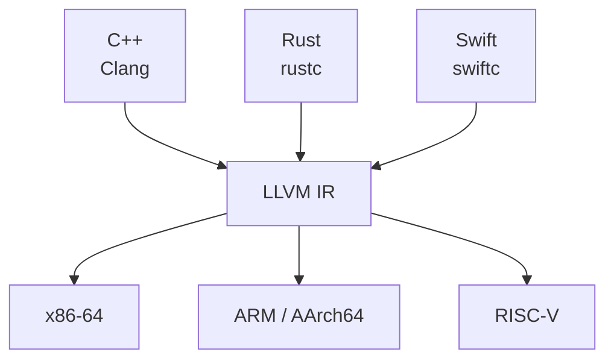
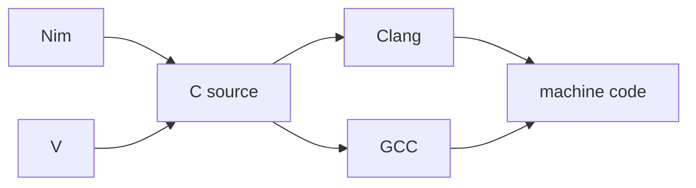
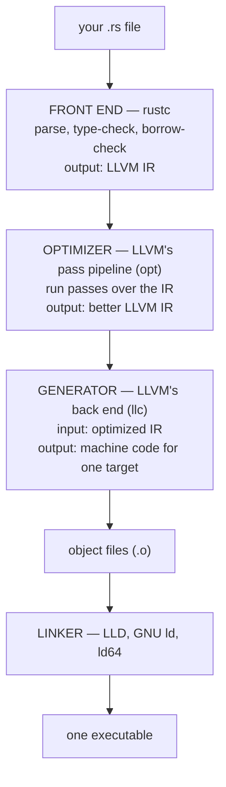
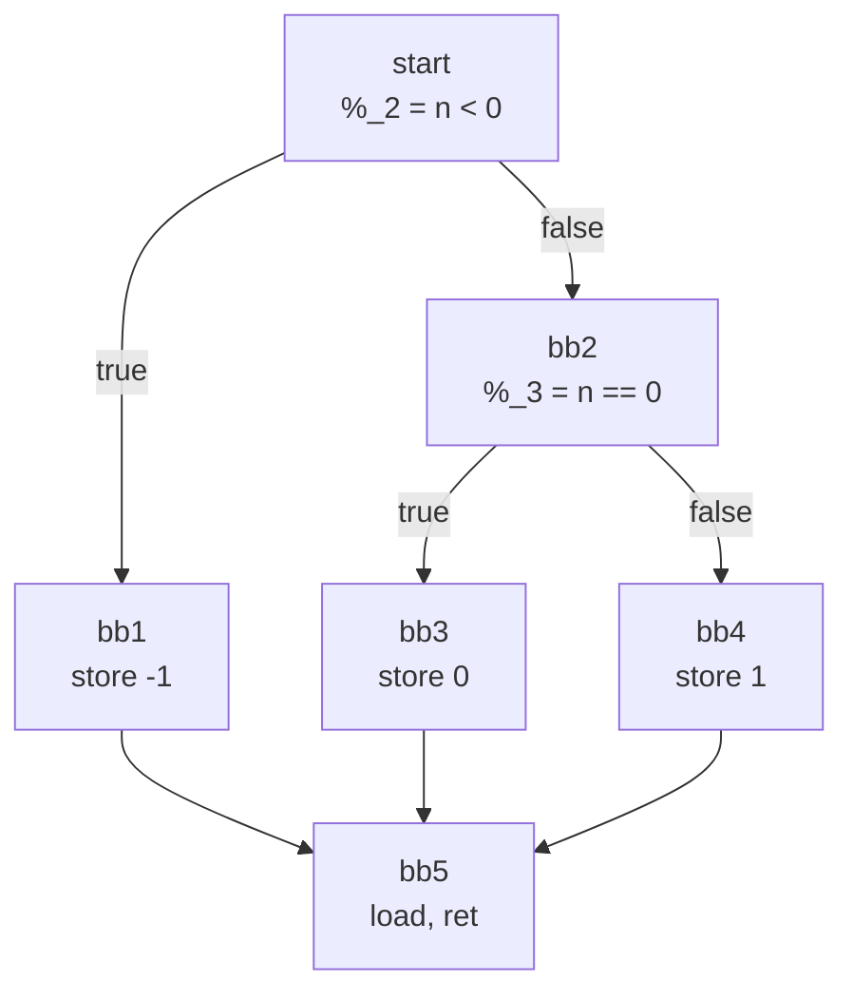

# LLVM: the part of rustc that is not Rust

**Level:** 201 · working knowledge

**One line:** LLVM is not a compiler for any language — it is a compiler's *back half*, plus the tools built around it, and rustc is one of a dozen front ends feeding the same optimizer, the same code generator, and often the same linker and debugger.

Point at "LLVM" on a diagram of the compiler world and you are pointing at four different things, which is most of why the name is confusing:

| The name means | Which is | Rust's relationship to it |
|---|---|---|
| **The project** | An umbrella holding Clang, LLD, LLDB, `opt`, `llc`, `libc++` and more | Uses several pieces, ships none of them |
| **The library** | `libLLVM` — optimizer plus code generator, callable from a program | rustc links it and calls it; it is most of `rustc`'s binary size |
| **The IR** | LLVM IR, a typed, machine-independent assembly language | rustc's output, and LLVM's input |
| **The pipeline** | Front end → optimizer → generator | rustc is the front end; the other two are LLVM's |

## Three languages, one waist



Every front end above the waist is written once per *language*; every back end below it is written once per *chip*. Without the waist that is a grid — twelve languages times six architectures, seventy-two code generators, each maintained by somebody. With it, adding Zig costs one front end and adding a new chip costs one back end, and both immediately work with everything else. That is the entire architectural argument for LLVM, and it is why a language as young as Rust could target ARM, RISC-V and WebAssembly without anyone writing a code generator for any of them.

The cost is inheritance: rustc gets LLVM's build times, LLVM's bugs, and LLVM's model of what a program is. Anything Rust knows that the model cannot express — ownership, for one — has to be checked in the front end or not at all.

## The other route: transpile to C

A language that does not want to write a back end has a second option — emit C, and let an existing compiler finish the job. **Nim** and **V** both do this, and the target is not really C so much as *everyone who already compiles C*:



It is the same hourglass one layer up, with C as the waist instead of LLVM IR, and it buys reach that would otherwise take years — every platform with a C compiler, including ones LLVM does not target. What it costs is everything the C type system cannot say. Debug information describes the generated C rather than your source, so a debugger shows you code you never wrote; undefined behaviour in the emitted C is yours to avoid; and the front end's guarantees have to survive a trip through a language that makes none.

Rust does not do this — rustc goes to LLVM IR directly — with one interesting exception. [mrustc ↗](https://github.com/thepowersgang/mrustc) is an independent Rust compiler that emits C, written so that rustc can be **bootstrapped** without an existing rustc binary: build mrustc with a C compiler, use it to build an old rustc from source, then walk that forward. Every self-hosted compiler has this chicken-and-egg problem, and transpilation to C is one of the two standard answers to it.

## The three stages

The talk this section follows draws the pipeline as three boxes, and they are worth naming precisely, because only the first is per-language:



Swap the first box for **Clang** and you have C++; swap it for the Swift compiler and you have Swift. Everything from the second box onward is shared — which is the concrete content of the claim that Rust is "as fast as C". It is not a claim about two teams achieving similar results. Below the IR, it is the same program doing the work.

Two boxes are missing from that picture on the Rust side, and both sit *before* the IR: rustc lowers your source to **HIR** and then to **MIR**, its own intermediate representations, and borrow checking happens on MIR. Nothing about ownership survives into LLVM IR — by the time LLVM sees your program, lifetimes have done their job and are gone.

## What the suite contains

The names that cluster around LLVM on any compiler map are its own tools:

| Tool | What it is | Does Rust use it? |
|---|---|---|
| **Clang** | The C, C++ and Objective-C front end. Same role as rustc, different language | Yes, indirectly — `cc` shells out to it on macOS, and `cc`-crate builds of C dependencies go through it |
| **LLD** | LLVM's linker. Faster than GNU `ld`, and a drop-in for it | Increasingly — recent Rust defaults to `lld` on x86-64 Linux; macOS still uses `ld64` |
| **LLDB** | LLVM's debugger. `rust-lldb` is a wrapper that teaches it to print Rust types | Yes — it is the debugger behind most IDE stepping on macOS |
| **`opt`** | Runs pass pipelines over IR, standalone | Not in a normal build — rustc calls the same passes through `libLLVM` |
| **`llc`** | Turns IR into assembly, standalone | Same: rustc calls the library, not the binary |

`opt` and `llc` are the two worth knowing about even though a Rust build never invokes them, because they are how you can run a single pass by hand over IR you emitted — which is exactly what an obfuscator does, and exactly how an analyst undoes one.

## What is inside the library

rustc does not run `opt` and `llc` as programs — it links `libLLVM` and calls it. Four of that library's components turn up by name whenever anyone opens the box:

| Component | What it is | Where Rust meets it |
|---|---|---|
| **IR** | The in-memory representation and the API for building it | rustc's codegen calls this directly, one function at a time |
| **Bitcode** | IR's binary serialization — `.bc` to the textual `.ll` | `--emit=llvm-bc`; an rlib carries bitcode so that LTO can optimize across crates |
| **Demangle** | Turns an encoded symbol back into a readable name | `_RNvCs...` → `crate::module::function`; it understands Rust's v0 scheme as well as C++'s |
| **Obfuscation** | *Not* in upstream LLVM — the directory an obfuscator fork adds beside the others | Nothing, in a stock toolchain: see [Control-flow flattening](../control_flow_flattening/README.md) |

The fourth row is the interesting one. An obfuscator is not a tool that post-processes a binary; it is a component sitting next to `IR` and `Bitcode` inside the compiler library, using the same interfaces as everything else in there.

## The IR itself

```rust
#[unsafe(no_mangle)]
pub extern "C" fn classify(n: i32) -> i32 {
    if n < 0 { -1 } else if n == 0 { 0 } else { 1 }
}
```

<!-- output:llvm_and_its_ir -->
*Verified output of [`llvm_and_its_ir.rs`](examples/llvm_and_its_ir.rs) — regenerated by `tools/run_examples.py`, never hand-typed.*

```text
classify(-5) = -1
classify( 0) =  0
classify( 7) =  1
```
<!-- /output -->

```sh
rustc --edition 2024 --emit llvm-ir -C opt-level=0 -C debuginfo=0 cfg.rs
```

```text title="rustc 1.98.0, x86_64-apple-darwin — the classify function only"
define i32 @classify(i32 %n) unnamed_addr #0 {
start:
  %_0 = alloca [4 x i8], align 4
  %_2 = icmp slt i32 %n, 0
  br i1 %_2, label %bb1, label %bb2

bb2:                                              ; preds = %start
  %_3 = icmp eq i32 %n, 0
  br i1 %_3, label %bb3, label %bb4

bb1:                                              ; preds = %start
  store i32 -1, ptr %_0, align 4
  br label %bb5

bb4:                                              ; preds = %bb2
  store i32 1, ptr %_0, align 4
  br label %bb5

bb3:                                              ; preds = %bb2
  store i32 0, ptr %_0, align 4
  br label %bb5

bb5:                                              ; preds = %bb1, %bb3, %bb4
  %0 = load i32, ptr %_0, align 4
  ret i32 %0
}
```

It reads like assembly with types and unlimited registers, which is what it is. Four features carry most of it:

- **`%name`** is a value; `i32`, `i1` and `ptr` are its type. IR is typed, unlike real assembly.
- **`start:`, `bb1:`, `bb2:`** are **basic blocks** — straight-line runs of instructions with one entry at the top and one exit at the bottom.
- **`br`** is the only way out of a block: `br i1 %cond, label %a, label %b` is a two-way branch, `br label %b` an unconditional jump.
- **`; preds = %bb2`** is a comment LLVM writes for you, listing which blocks can jump *into* this one.

There are no registers to allocate, no stack offsets, no instruction selection. Those are the generator's job, and they are the reason the same IR can become x86-64, ARM or RISC-V.

## The function graph

Blocks are nodes, `br` instructions are edges, and the result is the **control-flow graph** — the picture every disassembler, every optimizer pass and every reverse engineer works from. Read straight off the IR above:



Six nodes, and the shape *is* the source code: two decisions, three outcomes, one exit. Anyone reading that graph can recover what the function does without seeing a line of Rust — which is the property an obfuscator exists to destroy.

**Control-flow flattening** is the standard way to destroy it. Every block is cut loose, given a number, and parked as a sibling under one dispatcher; a state variable decides what runs next, and each block's last act is to set the state and jump back. The graph becomes a fan — one switch at the top, dozens of blocks hanging off it in a row, edges all returning to the same place — with no visible relationship to the program's structure. The talk's slide of that shape is a wall of parallel blue bars, and that is what it means: a function whose graph has been made to say nothing.

Nothing about the behaviour changes. It is the same permission the optimizer runs on, used for the opposite purpose — [What the optimizer does](../what_the_optimizer_does/README.md) is that permission being used to make a program smaller, and [Control-flow flattening](../control_flow_flattening/README.md) is the map of where a hostile one gets inserted.

## Seeing it for yourself

| To get | Run |
|---|---|
| LLVM IR | `rustc --emit llvm-ir -C debuginfo=0 file.rs`, then read the `.ll` |
| Assembly | `rustc --emit asm -C opt-level=3 file.rs` |
| Rust's own IR, after borrow checking | `rustc --emit mir file.rs` |
| Either of the first two, for someone else's target, in a browser | [Compiler Explorer ↗](https://godbolt.org/) |

`-C debuginfo=0` is worth passing every time: without it the IR is mostly `!dbg` metadata and the function you came to read is hard to find.

## See also

- [What the optimizer does](../what_the_optimizer_does/README.md) — the middle box, measured: twenty-nine instructions become one
- [The linker](../the_linker/README.md) — what happens after the generator, and the one stage that is nobody's compiler
- [Compile times](../../05_Tooling/compile_times/README.md) — codegen is LLVM's share of your build, and Cranelift is the alternative back end that trades output quality for speed
- [LLVM Language Reference ↗](https://llvm.org/docs/LangRef.html) — the IR, defined
