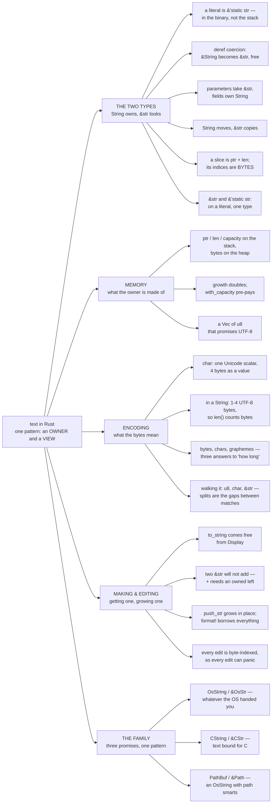

# Strings

**Level:** reference · the map

**One line:** Text in Rust is one pattern — an *owner* and a *view* — met four times: in the two everyday types, in the memory they manage, in the characters they encode, and in the wider family for text that keeps different promises. This page is the door to every lesson about it, in the order the questions come up.

**If you just want to know which type to write, read [`String` vs `&str`](01_Foundations/string_vs_str/README.md)** — the tables below are the route, not the explanation.

Same rule as the other maps: order is presentation, so it lives here rather than in folder names — [STRUCTS.md](STRUCTS.md) explains why in full, and [OPTION.md](OPTION.md) and [SHADOWING.md](SHADOWING.md) follow it too.

---

## The territory, as a picture

## Start here

| # | Lesson | Level | The question it answers |
|---|---|---|---|
| 1 | [`String` vs `&str`](01_Foundations/string_vs_str/README.md) | 101 → 201 | Which of the two types do I write here — and why does every parameter want `&str`? |
| 2 | [String slices](01_Foundations/string_slices/README.md) | 101 → 201 | What a view actually is: the stale index it replaces, the `E0502` that keeps it honest, and the one way `&s[a..b]` panics |
| 3 | [The anatomy of a `String`](01_Foundations/anatomy_of_a_string/README.md) | 101 → 201 | What the owner *is*: three words on the stack, bytes on the heap, and a capacity that is not the length |
| 4 | [Making a `String`](01_Foundations/making_a_string/README.md) | 101 → 201 | `to_string` vs `to_owned` vs `String::from` vs `into` vs `format!` — and why `Display` is the only one you implement |
| 5 | [Concatenating strings](01_Foundations/concatenating_strings/README.md) | 101 → 201 | Why `"a" + "b"` will not compile — the single `Add` impl, the `E0369`/`E0308`/`E0368` family it produces, and what to write instead |
| 6 | [Building a `String`](01_Foundations/building_a_string/README.md) | 101 → 201 | `push_str`, `push`, the `+` that consumes its left operand, and `format!` vs `write!` inside a loop |
| 7 | [Meet the `char`](01_Foundations/meet_the_char/README.md) | 101 → 201 | What the bytes encode — why `.len()` is not "how many characters", and why `s[0]` refuses to compile |
| 8 | [Walking a `String`](01_Foundations/walking_a_string/README.md) | 101 → 201 | Three item types and the split family — and why `split(' ')` and `split_whitespace()` disagree about empty fields |
| 9 | [`&'static str`](01_Foundations/static_str/README.md) | 201 | Is it different from `&str`? On a literal, no — and the claim that a `String` can never yield one is false |
| 10 | [Six kinds of string](01_Foundations/six_kinds_of_string/README.md) | 201 | Why `OsString` and `CString` exist, and the one owned/borrowed pattern all six types repeat |

## The lessons strings lean on

Strings are the worked example half the library's ownership pages already use, so the deep explanations live there:

| Lesson | Level | What it settles for strings |
|---|---|---|
| [Ownership and moves](01_Foundations/ownership_and_moves/README.md) | 101 | The `E0382` a moved `String` produces — in full, with a value that announces its own death |
| [`Copy` vs `Clone`](01_Foundations/copy_vs_clone/README.md) | 101 → 201 | Why `&str` copies freely, and one `String` field makes a whole struct move |
| [Borrowing](01_Foundations/borrowing/README.md) | 101 → 201 | The rule that refuses a view held across a `push_str` |
| [How to learn lifetimes](01_Foundations/how_to_learn_lifetimes/README.md) | 201 | Why "own `String`, clone when stuck" is legitimate advice while `&str` fields wait |
| [Meet the byte](01_Foundations/meet_the_byte/README.md) | 101 → 201 | The unit `len` counts in — this map's encoding arc is what those bytes *mean* |
| [What is a ballot, in memory?](01_Foundations/representing_a_ballot/README.md) | 201 | `String` fields chosen inside a real struct design |
| [`Path` and `PathBuf`](04_Files/path_and_pathbuf/README.md) | 201 | The family's honorary pair, in full — a **stub** for now |

## Still missing

Named honestly, because a map that only lists what exists is a map of the wrong territory. Each becomes a page once it has a runnable example worth reading — rough order, not a promise:

- **Parsing out of a string** — `.parse()` beyond the one worked example, `FromStr` for your own type, and what to do with the `Result` that is not `.unwrap()`
- **Searching without splitting** — `find` / `rfind` / `contains` / `starts_with`, and `Pattern` as the trait that unifies them with the split family
- **`str` is unsized** — `?Sized`, why you only ever meet `str` behind a pointer, and what a fat pointer is
- **The third owned form** — `Box<str>`, `Rc<str>`, `Arc<str>`: frozen text without the capacity word, and when the 8-byte saving matters
- **`Cow<str>`** — the maybe-owned string: borrow when unchanged, allocate only when you must
- **Raw strings and escapes** — `r"…"`, `r#"…"#`, `\u{…}`, and byte strings `b"…"`
- **The format mini-language** — `{:>8.3}`, `{:#x}`, `{val:^width$}`: fill, align, sign, width, precision, and the `$` that makes them dynamic
- **Comparing and sorting** — `Ord` on strings is byte order, which is not human order; case folding vs `to_lowercase`
- **String APIs worth copying** — `impl AsRef<str>`, `Into<String>`, and when a signature should take `impl Display`
- **When `String` is too slow** — `with_capacity` in anger, `smallstr` / `smartstring`, and avoiding a `format!` that a literal would do

If you want one of these next, that is the list to point at.

## Looking a term up

[GLOSSARY.md](GLOSSARY.md) defines the vocabulary these pages use — string slice, string literal, deref coercion, capacity, Unicode scalar value, grapheme cluster, the `OsString` and `CString` pairs — and every entry links the page that explains it properly.
