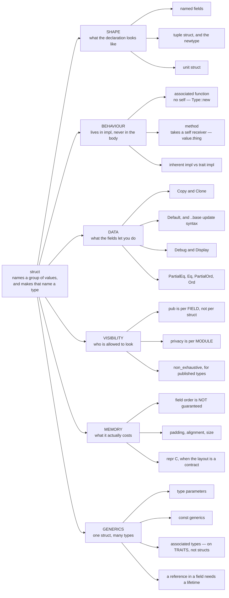
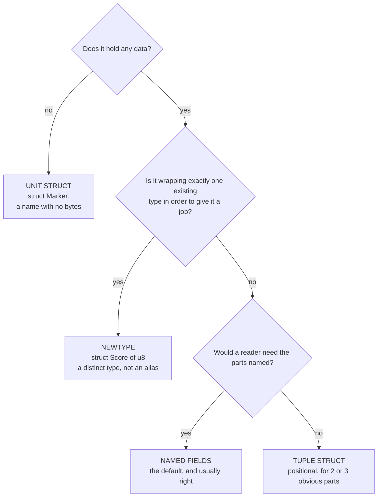
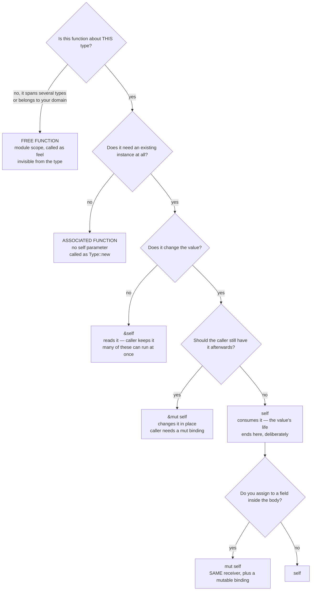
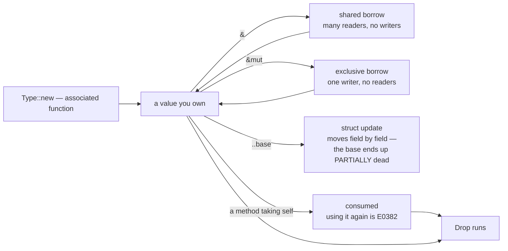

# Structs

**Level:** reference · the map

**One line:** A struct names a group of values and makes that name a type — and this page is the door to every lesson about structs, in the order the questions actually come up.

Structs are the type you define on your first day and are still designing in your third month, so the lessons are spread across the library rather than gathered in one folder. What follows is a reading order, not a syllabus; start where your question is.

**If you just want to know what a struct *is*, read [What a struct is](01_Foundations/what_a_struct_is/README.md)** — the tables below are the route, not the explanation.

---

## Why this is a page and not a folder

Because folders are permanent URLs. A topic — the newtype, `Option` fields, lifetimes — is stable for years; a *sequence* is not, and the moment a lesson belongs between §II and §III a numbered folder either gets renumbered (breaking every link anyone saved) or starts lying about its own order.

So the library keeps a strict split, and it is worth knowing which surface answers which question:

| Surface | Holds | Example |
|---|---|---|
| a **topic folder** | one idea, with a runnable program | `01_Foundations/what_a_struct_is/` |
| **this map** | the reading order, and what is still missing | you are here |
| [KATAS.md](KATAS.md) | the exercises, numbered — the numbers live nowhere else | K52 |
| [GLOSSARY.md](GLOSSARY.md) | the vocabulary, one line each, linking the page | *associated function* |

Same rule the sidebar follows: order is presentation, so it belongs in a page, never in a path. [OPTION.md](OPTION.md), [SHADOWING.md](SHADOWING.md) and [STRINGS.md](STRINGS.md) are the other maps.

## The territory, as a picture

Four diagrams, because a map of the vocabulary is a different question from *"which one do I write here?"*. They render on GitHub and on the site from the same source.

### 1. The whole territory, and its keywords

Everything a struct question turns out to be about, in one frame. If a term below is unfamiliar, [GLOSSARY.md](GLOSSARY.md) defines it in a line.

### 2. Which flavour do I declare?

The newtype branch is the one people skip and then want back: [A score is not a number](01_Foundations/newtype_score/README.md), and why [an alias gives no safety at all](01_Foundations/result_aliases/README.md).

### 3. Which receiver do I write?

The decision that causes the most compiler errors, and the one most tutorials get slightly wrong.

A free function that returns a `Feelings` and does nothing else is an associated function written in the wrong place. Nothing about the behaviour differs — what differs is that `Feelings::new()` is found by typing `Feelings::`, appears in the type's documentation, and can satisfy a trait requirement, while a free `feel()` does none of the three.

**`mut self` is not a fourth receiver.** It is `self` with a mutable binding, exactly like `fn f(mut x: T)`. The caller cannot see the difference — a trait that declares `fn consume(self)` may be implemented as `fn consume(mut self)`, and calling a `mut self` method needs no `mut` on the caller's binding. Both facts are compiled, not asserted.

The rarer spellings — `self: Box<Self>`, `Rc<Self>`, `Arc<Self>`, `Pin<&mut Self>` — *are* real receivers and do change what the caller must hand over. The [Reference](https://doc.rust-lang.org/reference/items/associated-items.html) gives the full grammar.

### 4. The life of one instance

`Drop` is skipped by `std::process::abort` and by `std::mem::forget` — running a destructor is a strong default, not a guarantee.

## Start here

| # | Lesson | Level | The question it answers |
|---|---|---|---|
| 1 | [What a struct is](01_Foundations/what_a_struct_is/README.md) | 101 → 201 | The three flavors, `impl` vs the struct body, associated function vs method, and why privacy is per *module* |
| 2 | [`impl` blocks](01_Foundations/impl_blocks/README.md) | 101 → 201 | Where the functions went — associated function vs method, the three receivers, and inherent vs trait impl |
| 3 | [A score is not a number: the newtype](01_Foundations/newtype_score/README.md) | 101 → 201 | The tuple struct with a job — one checked door, and the invalid value stops existing |
| 4 | [`Option` fields](01_Foundations/option_fields/README.md) | 101 | Required by default, and the one question that decides whether a field should be optional at all |
| 5 | [Debug and Display](01_Foundations/debug_vs_display/README.md) | 101 → 201 | Why `{}` refuses your struct and `{:?}` does not — the first derive you will reach for |
| [When a struct refuses](01_Foundations/when_a_struct_refuses/README.md) | 101 → 201 | The eight errors you will actually hit — and why `E0277` names four unrelated problems |
| [What `dbg!` does](01_Foundations/what_dbg_does/README.md) | 101 → 201 | Five things it does that `println!("{:?}")` does not — and why a field prints when the struct will not |

## The data inside

| Lesson | Level | What it teaches |
|---|---|---|
| [`Copy` vs `Clone`](01_Foundations/copy_vs_clone/README.md) | 101 → 201 | Why a struct is never `Copy` by accident, and the three refusals — `E0277`, `E0204`, `E0184` |
| [Struct update syntax](01_Foundations/struct_update/README.md) | 101 → 201 | `..base` moves field by field, so the base ends up *partially* dead — and `Copy` decides which half |
| [`Some` is a constructor, not a flag](01_Foundations/some_is_a_constructor/README.md) | 101 → 201 | `Some(None)` in a field, and the doubly-optional type that makes it legal |
| [What is a ballot, in memory?](01_Foundations/representing_a_ballot/README.md) | 201 | Designing a real struct: the layout choices, and the parallel `Vec`s that desync |
| [Six kinds of zero](01_Foundations/six_kinds_of_zero/README.md) | 201 | When a field's zero is a value and when it is a hole |
| [Bit flags](01_Foundations/bit_flags/README.md) | 201 | Packing several fields into one integer, and when that is worth doing |
| [The `Result` you are reading is probably an alias](01_Foundations/result_aliases/README.md) | 201 | The *other* way to name a type — and why an alias gives no safety at all |

## Ownership, borrowing, lifetimes

A struct owning its fields is the default, and the reason [`String` shows up in beginner code where `&str` looks tidier](01_Foundations/string_vs_str/README.md).

| Lesson | Level | What it teaches |
|---|---|---|
| [Ownership and moves](01_Foundations/ownership_and_moves/README.md) | 101 | A move transfers responsibility — what happens when a struct owns its fields |
| [Borrowing](01_Foundations/borrowing/README.md) | 101 → 201 | `&T` and `&mut T`, and the rule that decides which order compiles |
| [How to learn lifetimes](01_Foundations/how_to_learn_lifetimes/README.md) | 201 | Is *"clone everything"* good advice? Mostly — with three amendments |
| [A name is not a place](01_Foundations/a_name_is_not_a_place/README.md) | 201 | Why `mut` belongs to the binding, which is why you cannot mark one field mutable |

## Deriving, and the traits you get for free

| Lesson | Level | What it teaches |
|---|---|---|
| [`unwrap_or_default`](01_Foundations/unwrap_or_default/README.md) | 201 | A derived `Default` is the *type's* zero, not your domain's — and struct update syntax |
| [The `Default` trait](03_Command_Line/the_default_trait/README.md) | 201 | `..Default::default()` and the config struct built out of it — **stub**, an outline only |
| [`serde` derive](06_Data/serde_derive/README.md) | 201 | The derive that turns a struct into a wire format — **stub**, an outline only |
| [`clap` derive](03_Command_Line/clap_derive/README.md) | 201 | A struct that *is* the command-line interface — **stub**, an outline only |
| [Comments that compile](01_Foundations/comments_that_compile/README.md) | 101 → 201 | `///` on a field or a method is `#[doc]`, and its examples are run as tests |

## Structs in the wild

| Lesson | Level | What it teaches |
|---|---|---|
| [Units are types](07_Clients/units_are_types/README.md) | 201 | The newtype used in anger: a quantity that cannot be added to the wrong quantity — **stub**, an outline only |
| [The right to vote is a value](09_Advanced/one_person_one_vote/README.md) | 301 | A struct modelling an entitlement, and spending it exactly once |
| [Lock poisoning](09_Advanced/mutex_poisoning/README.md) | 301 | A struct shared across threads, and the `Result` the lock hands you |

## Still missing

Named honestly, because a map that only lists what exists is a map of the wrong territory. Each becomes a page once it has a runnable example worth reading — rough order, not a promise:

- **Destructuring a struct** — in a `let`, in a `match` arm, and in a function parameter
- **Comparing structs** — `PartialEq` / `Eq` / `PartialOrd` / `Ord`, and the derive that compares fields in declaration order
- **Generic structs** — `Point<T>`, and the trait bound that lets you add two of them
- **Implementing a trait for your struct** — including default methods, and why this replaces inheritance
- **A reference in a field** — `E0106` in full, `struct User<'a>`, and what `'static` does and does not promise
- **Enum variants that carry structs** — the nesting that makes a state machine, and matching it
- **The builder pattern** — and the simpler thing that usually beats it
- **Const generics** — `struct Board<const PINS: usize>`, and why the `impl` needs the parameter too
- **Associated types** — and the trap that they live on **traits**, never in a struct body
- **Zero-sized types** — `struct Nothing;` costs no bytes, and why `Set<K> = Map<K, ()>` is free
- **Layout, padding and `repr`** — why `String, String, u8` is 56 bytes and not 49, and when field order becomes a contract
- **Swapping two fields** — `mem::swap` needs *one* type, so two `&mut` into different fields is the interesting half

If you want one of these next, that is the list to point at.

## The thing that is shaped like a struct but is not one

A [**union**](09_Advanced/what_a_union_is/README.md) is declared exactly like a struct and behaves nothing like one: its fields share a single slot rather than sitting side by side. It is worth reading once, because the punchline settles a question this map raises twice — a Rust `enum` **is** a union with a tag the compiler makes you read, which is why you can model a choice without ever writing `unsafe`.

## The material that is not in this library

[**Structs: the shelf**](10_Resources/structs/README.md) is the checked list of outside material — the Book chapter worth reading, the Reference pages that settle an argument, the videos with their chapter marks, and the four links that have rotted since they were collected.

## Looking a term up

[GLOSSARY.md](GLOSSARY.md) defines the vocabulary these pages use — associated function, unit struct, tuple struct, field init shorthand, struct update syntax, newtype — and every entry links to the page that explains it properly.
