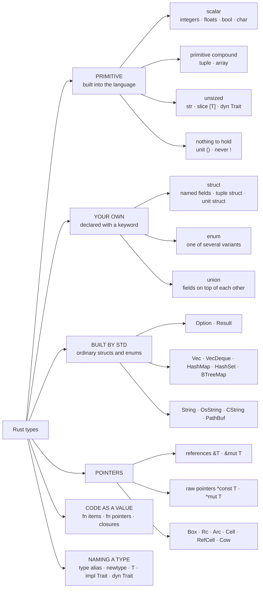

# The types map

**Level:** reference · the map

**One line:** Every Rust type is built from a short list of primitives, two ways you combine them yourself (`struct` and `enum`), and a handful of std types assembled from those — this page is that tree, with the lesson for every branch.

Type questions arrive under many names — *data types*, *compound types*, *collections*, *smart pointers*, *aliases* — and the lessons that answer them sit in a dozen sections, because each one lives beside the idea it is used for. This page is the one place they hang from a single tree. To look a topic up by any name at all, use [TOPICS.md](TOPICS.md) instead.

## The tree

## Compound types: the two that are primitive

A compound type groups several values into one type. [The Book, §3.2 ↗](https://doc.rust-lang.org/book/ch03-02-data-types.html#compound-types) says Rust has **two primitive compound types: tuples and arrays**. That sentence is easy to misread in two directions, so here is what it does and does not include:

| Type | Primitive compound? | Why |
|---|---|---|
| tuple `(i32, &str)` | **yes** | built into the language; values of different types, fields numbered — [Tuples](26_Collections/tuples/README.md) |
| array `[u8; 3]` | **yes** | built into the language; one element type, length fixed in the type — [Arrays: the map](26_Collections/arrays/README.md) |
| `Vec<T>` | no | a struct in `std` over a heap allocation — a *collection*, not a primitive |
| `HashMap<K, V>`, `String` | no | structs in `std`, same reason |
| `struct`, `enum` | no | compound, but *user-defined*: you declare them, the language does not provide them |
| slice `[T]`, `str` | primitive, not compound | a run of values with no size known at compile time — you only ever hold a pointer to one |

## Primitive types

| Type | Lesson | Notes |
|---|---|---|
| `i8`…`i128`, `u8`…`u128`, `isize`, `usize` | [The integer types](19_Numbers/the_integer_types/README.md) · [Writing a number down](19_Numbers/writing_a_number_down/README.md) · [Meet the byte](19_Numbers/meet_the_byte/README.md) | `u8` is the unit every size is counted in |
| `f32`, `f64` | [What a float actually stores](19_Numbers/what_a_float_stores/README.md) · [Making a float whole](19_Numbers/rounding_a_float/README.md) | `f16` and `f128` are nightly-only on 1.98.0 |
| `bool` | [Meet the `bool`](15_First_Programs/meet_the_bool/README.md) | not a number, no truthiness |
| `char` | [Meet the `char`](14_Strings/meet_the_char/README.md) · [Why a `char` is 32 bits](14_Strings/why_char_is_32_bits/README.md) | one Unicode scalar value, always four bytes |
| tuple | [Tuples](26_Collections/tuples/README.md) | a struct whose fields are numbered |
| array `[T; N]` | [Arrays: the map](26_Collections/arrays/README.md) · [Arrays and slices](26_Collections/arrays_and_slices/README.md) · [Array or `Vec`?](26_Collections/array_or_vec/README.md) · [Const generics](22_Generics/const_generics/README.md) | the length is part of the type |
| slice `[T]` | [Arrays and slices](26_Collections/arrays_and_slices/README.md) · [`slice` methods](26_Collections/slice_methods/README.md) | held as `&[T]`, a pointer and a length |
| `str` | [`str` is unsized](14_Strings/str_is_unsized/README.md) · [String slices](14_Strings/string_slices/README.md) | held as `&str` |
| unit `()` | [The unit type](15_First_Programs/the_unit_type/README.md) | the empty tuple: one value, zero bytes |
| never `!` | [The never type](15_First_Programs/the_never_type/README.md) | the type of an expression that does not finish; naming it as a type is nightly-only |
| references, pointers, `fn` | see [Pointers](#pointers) and [Code as a value](#code-as-a-value) below | |

All of these are listed in [std's primitive type docs ↗](https://doc.rust-lang.org/std/index.html#primitives), one page each.

## Your own types

| You write | Lesson | What to read next |
|---|---|---|
| `struct Point { x: i32, y: i32 }` | [What a struct is](16_Structs/what_a_struct_is/README.md) | [STRUCTS.md](STRUCTS.md), the whole structs map |
| `struct Meters(f64);` — tuple struct, newtype | [A score is not a number: the newtype](16_Structs/newtype_score/README.md) | [Units are types](07_Clients/units_are_types/README.md) |
| `struct Marker;` — unit struct | [What a struct is](16_Structs/what_a_struct_is/README.md) | [Marker traits](12_Traits/marker_traits/README.md) |
| `enum Shape { Circle(f64), Square(f64) }` | [What an enum is](13_Enums/what_an_enum_is/README.md) · [Variants that carry data](13_Enums/variants_that_carry_data/README.md) | [Generic enums](22_Generics/generic_enums/README.md) |
| `union` | [What a union is](09_Advanced/what_a_union_is/README.md) | [Type layout](09_Advanced/type_layout/README.md) |
| methods for any of them | [`impl` blocks](16_Structs/impl_blocks/README.md) | [What a trait is](12_Traits/what_a_trait_is/README.md) |

A struct is a **product** type and an enum is a **sum** type — the [glossary entry for algebraic data types](GLOSSARY.md) says why those words fit.

## Built by std

These look like language features and are ordinary library types, written with `struct` and `enum` like yours.

| Type | Lesson | Map |
|---|---|---|
| `Option<T>` | [`Some` and `None`](17_Option_and_Result/some_and_none/README.md) | [OPTION.md](OPTION.md) |
| `Result<T, E>` | [`Option` vs `Result`](17_Option_and_Result/option_vs_result/README.md) | [Errors](02_Errors/README.md) |
| `Vec<T>` | [`Vec`](26_Collections/the_vec/README.md) · [`Vec` methods](26_Collections/vec_methods/README.md) | [Collections](26_Collections/README.md) |
| `VecDeque<T>` | [`VecDeque`](26_Collections/the_vecdeque/README.md) | |
| `HashMap<K, V>`, `HashSet<T>` | [`HashMap`](26_Collections/the_hashmap/README.md) · [`HashSet`](26_Collections/the_hashset/README.md) | |
| `BTreeMap`, `BTreeSet` | [`BTreeMap` and `BTreeSet`](26_Collections/sorted_collections/README.md) | |
| `String` | [`String` vs `&str`](14_Strings/string_vs_str/README.md) · [The anatomy of a `String`](14_Strings/anatomy_of_a_string/README.md) | [STRINGS.md](STRINGS.md) |
| `OsString`, `CString` | [Six kinds of string](14_Strings/six_kinds_of_string/README.md) | |
| `PathBuf`, `Path` | [`Path` and `PathBuf`](04_Files/path_and_pathbuf/README.md) | |
| `Duration`, `Instant`, `SystemTime` | [Two clocks](33_Time_and_Benchmarking/two_clocks/README.md) · [A `Duration` cannot be negative](33_Time_and_Benchmarking/a_duration_cannot_be_negative/README.md) | |

## Pointers

| Type | Lesson | What it adds |
|---|---|---|
| `&T`, `&mut T` | [Address, pointer, reference](36_Pointers/address_pointer_reference/README.md) · [Borrowing](18_Ownership/borrowing/README.md) · [What `&'a T` claims](18_Ownership/what_a_reference_claims/README.md) | a checked loan: many readers or one writer |
| `*const T`, `*mut T` | [Raw pointers](36_Pointers/raw_pointers/README.md) · [What `unsafe` turns off](09_Advanced/what_unsafe_turns_off/README.md) | an address and nothing else — dereferencing needs `unsafe` |
| `&[T]`, `&str`, `&dyn Trait` | [Wide pointers](36_Pointers/wide_pointers/README.md) | an address plus a length or a vtable — two words |
| `Box<T>` | [`Box`](26_Collections/the_box/README.md) | one owner, on the heap |
| `Rc<T>` | [`Rc`: the clone that copies a pointer](18_Ownership/reference_counting/README.md) | several owners, one thread |
| `Arc<T>` | [Sharing across threads: `Arc`](18_Ownership/sharing_across_threads/README.md) | several owners, many threads |
| `Cell<T>`, `RefCell<T>` | [Interior mutability](09_Advanced/interior_mutability/README.md) | writing through a `&T`, checked at run time |
| `Cow<'a, B>` | [`Cow`: borrow until somebody writes](18_Ownership/clone_on_write/README.md) | borrowed or owned, decided at run time |
| `Option<Box<T>>` | [Nullable pointers](17_Option_and_Result/nullable_pointers/README.md) | a pointer that may be absent, at no extra size |
| any of the above, in general | [Smart pointers](41_Smart_Pointers/README.md) · [What a smart pointer is](18_Ownership/what_a_smart_pointer_is/README.md) | `Deref` to act like a reference, `Drop` to do a job |

## Code as a value

| Type | Lesson |
|---|---|
| `fn(u32) -> u32` — function pointer | [Function pointers](23_Closures/function_pointers/README.md) |
| a closure's anonymous type, and `Fn` / `FnMut` / `FnOnce` | [What a closure is](23_Closures/what_a_closure_is/README.md) · [The three closure traits](23_Closures/three_closure_traits/README.md) |
| a function declared inside a function | [Items inside a function](27_Modules/items_inside_a_function/README.md) |

## Naming a type

| You write | Lesson | What it is not |
|---|---|---|
| `type Km = u32;` | [A type alias is not a new type](16_Structs/type_aliases/README.md) · [The `Result` alias](17_Option_and_Result/result_aliases/README.md) | a distinct type — that is the newtype |
| `struct Km(u32);` | [A score is not a number: the newtype](16_Structs/newtype_score/README.md) | free of boilerplate — it has none of `u32`'s methods |
| `fn f<T>(x: T)` | [What a generic is](22_Generics/what_a_generic_is/README.md) · [Where the bound goes](22_Generics/where_the_bound_goes/README.md) | a runtime type — each `T` is compiled separately |
| `-> impl Trait` | [Returning a trait](12_Traits/returning_a_trait/README.md) | several types — one concrete type, hidden |
| `&dyn Trait`, `Box<dyn Trait>` | [Static vs dynamic dispatch](12_Traits/static_vs_dynamic_dispatch/README.md) | free — a vtable call, and a wide pointer |
| `PhantomData<T>` | [Phantom types](12_Traits/phantom_types/README.md) | data — zero bytes, a tag for the compiler |

## Between types

| Question | Lesson |
|---|---|
| Which type did the compiler pick? | [Type inference](15_First_Programs/type_inference/README.md) · [What a type annotation does](15_First_Programs/what_an_annotation_does/README.md) |
| How do I turn one into another? | [Conversion](29_Conversion/README.md): [`as`](29_Conversion/casting_with_as/README.md) · [`From` and `Into`](29_Conversion/from_and_into/README.md) · [`TryFrom`](29_Conversion/tryfrom_and_tryinto/README.md) · [coercion](29_Conversion/coercion/README.md) |
| Is it copied or moved? | [Copy or move?](18_Ownership/copy_or_move/README.md) · [`Copy` vs `Clone`](16_Structs/copy_vs_clone/README.md) |
| How big is it, and where do the bytes go? | [Stack and heap](18_Ownership/stack_and_heap/README.md) · [What is a record, in memory?](16_Structs/representing_a_record/README.md) · [Type layout](09_Advanced/type_layout/README.md) |

## If you are coming from another language

- **Python.** Python's `list` is Rust's `Vec`, `tuple` is a tuple, `dict` is `HashMap` and `set` is `HashSet` — and Python has nothing like the array, whose length the compiler knows, or like the split between an owner (`String`) and a view (`&str`). The Python library's [`str` is not `bytes` ↗](https://masiarek.github.io/python-learning-library/01_Text_and_Bytes/str_is_not_bytes/) is the one type split both languages make.
- **C.** Scalars, arrays and `struct` transfer directly, `union` too. What is new: a tagged `enum` the compiler checks, a slice that carries its length (the C library's [a string is bytes up to a NUL ↗](https://masiarek.github.io/c-learning-library/03_Strings/a_string_is_bytes_up_to_a_nul/) shows the alternative), and no implicit conversions between numeric types.
- **Java.** No primitive/boxed split and no `null`: `Option<T>` is the nullable type, and a generic `Vec<i32>` stores `i32`s inline instead of boxed `Integer`s.
- **Go.** Arrays with the length in the type and slices as views are the same design; Rust adds `enum` with data, which Go spells with interfaces and type switches.
- **ABAP.** A structure is a `struct`, an internal table is a `Vec`, and a fixed-length field such as `c LENGTH 10` is the closest thing to an array — the length is part of the type in both.

## Po polsku

Ta strona to drzewo typów: typy wbudowane (skalarne, dwa złożone — krotka i tablica — oraz typy bez rozmiaru, jak `str`), typy definiowane samodzielnie (`struct`, `enum`, `union`), typy zbudowane z nich przez bibliotekę standardową (`Option`, `Vec`, `String`), wskaźniki i sposoby nazywania typów. Zdanie z The Book, że Rust ma **dwa wbudowane typy złożone — krotki i tablice** — nie obejmuje `Vec`: wektor to zwykła struktura z biblioteki standardowej, czyli kolekcja, a nie typ wbudowany.

**Szukaj po polsku:** typy danych w Ruście · typy złożone · krotka i tablica · `rust primitive types` · `rust compound types tuple array`
